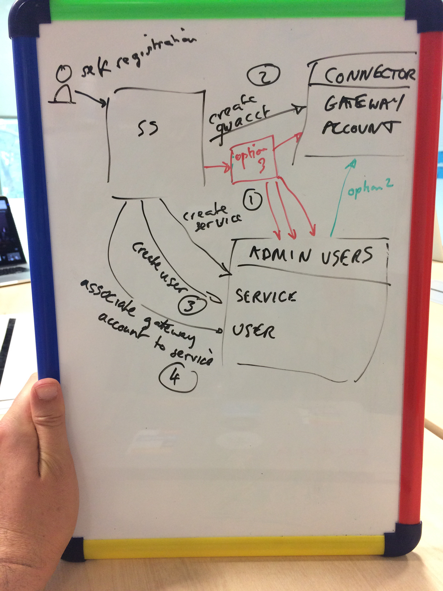

# ADR 001 - Orchestration of new service creation

## Context

The adminusers project is working on adding support for user self
registration. The business goal is to allow prospective services to register
with GOV.UK Pay and create a sandbox account without needing intervention from
our support team.

The proposed signup flow is approximately as follows:

1. user requests to create a new account by entering their email address and phone number
2. they are sent an email invitation including a hyperlink with a [nonce](https://en.wikipedia.org/wiki/Cryptographic_nonce)
3. they click the link to confirm their email address
4. they authenticate using a second authentication factor by entering a code sent by SMS
5. they've now authenticated themselves and the service creation begins†:
    1. a service is created in adminusers [`POST /v1/api/services`](https://github.com/alphagov/pay-adminusers/blob/master/docs/api_specification.md#post-v1apiservices)
    2. a gateway account is created in connector [`POST /v1/api/accounts`](https://github.com/alphagov/pay-connector/blob/master/docs/api_specification.md#post-v1apiaccounts), returns `gateway_account_id`
    3. a user is created in adminusers [`POST /v1/api/users`](https://github.com/alphagov/pay-adminusers/blob/master/docs/api_specification.md#post-v1apiusers)
    4. the service is updated to contain the gateway account id [`PATCH /v1/api/services/{serviceExternalId}`](https://github.com/alphagov/pay-adminusers/blob/master/docs/api_specification.md#patch-v1apiservicesserviceexternalid)

† I am not aware of any reason why the calls should be done in this particular order

There is uncertainty around the appropriate design for implementing this.

A few options have been proposed:

 
### Option A: Orchestration in `selfservice`

1. `selfservice` calls `POST` `http://adminusers/v1/api/services`
1. `selfservice` calls `POST` `http://connector/v1/api/accounts`
1. `selfservice` calls `POST` `http://adminusers/v1/api/users`
1. `selfservice` calls `PATCH` `http://adminusers/v1/api/services/{serviceExternalId}`

(shown in black in the diagram)

### Option B: Orchestration in `adminusers`

1. `selfservice` calls adminusers to create the service and user accounts
  1. `adminusers` calls `POST` `http://connector/v1/api/accounts`, and records the id `gateway_account_id`
  1. `adminusers` internally creates the user
  1. `adminusers` internally creates the service, recording the `gateway_account_id`

(shown in green as option 2 in the diagram)
  
### Option C: New `serviceManager` orchestration service

A new microservice, let's call it `serviceManager`

1. `selfservice` calls `serviceManager` to create the service and user accounts
   1. `serviceManager` calls `POST` `http://adminusers/v1/api/services`
   1. `serviceManager` calls `POST` `http://connector/v1/api/accounts`
   1. `serviceManager` calls `POST` `http://adminusers/v1/api/users`
   1. `serviceManager` calls `PATCH` `http://adminusers/v1/api/services/{serviceExternalId}`

(shown in red as option 3 in the diagram)

## Discussion

Several people favour *option C*, feeling that it will be cleaner and avoid
growing too much business logic in selfservice.

Several other people prefer *option A*, feeling that it follows the principle of
delivering business value as early as possible and does not preclude
extracting a microservice at a later date as and when a need arises.

Another concern raised was around the need for 'rollback'. Depending on the
order of calls we may be left with:

1. a sandbox gateway account in connector with no associated service or user in adminusers
2. a service and user account in adminusers, with no associated gateway account

Of the two possibilities above, option 1 (dangling sandbox account) seems
harmless. Option 2 could be made harmless by avoiding creating the user
account until the gateway account has properly been created and associated
with the service.

In general, following a principle of idempotency is a simpler way to ensure eventual consistency.

Dangling services or gateway accounts which are inaccessible to a user, whilst a little crufty, is not likely to cause any errors.

Given the above, we have agreed to persue **Option A** initially, to get the
feature shipped as quickly as possible. Once the code is in production, and as
future user needs are identified, we will have more information on which to
assess whether Option C is needed.

## Decision

Option A - Orchestration in `selfservice`

## Status

Accepted.

## Consequences

We accept the risk of possible dangling sandbox gateway accounts in connector.

We also accept the risk of possible dangling service records in adminusers.

We should design all internal API calls to be idempotent if doing so would not
increase complexity.

We should be aware of the risk of selfservice growing in complexity as more
requirements arise which require orchestration of multiple microservices, and
re-assess this decision should the complexity start to become burdensome. We
may also need to extract a microservice to allow these operations to be
exposed through a public API (or as a management API).
